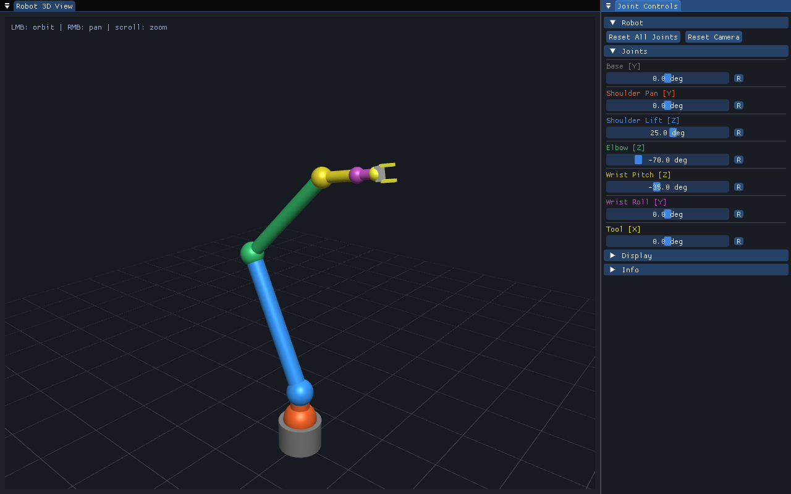
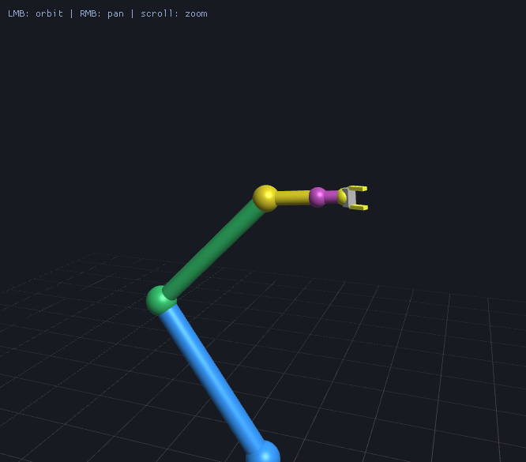
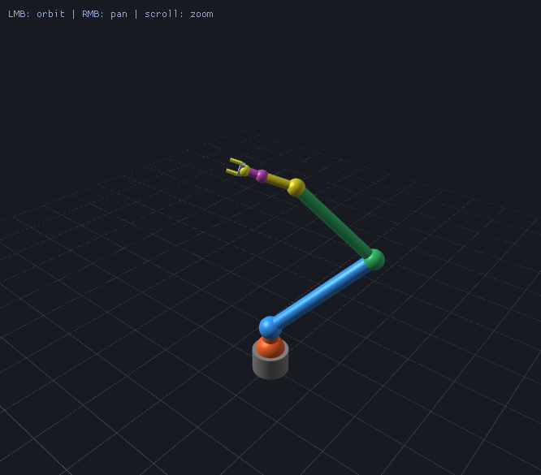
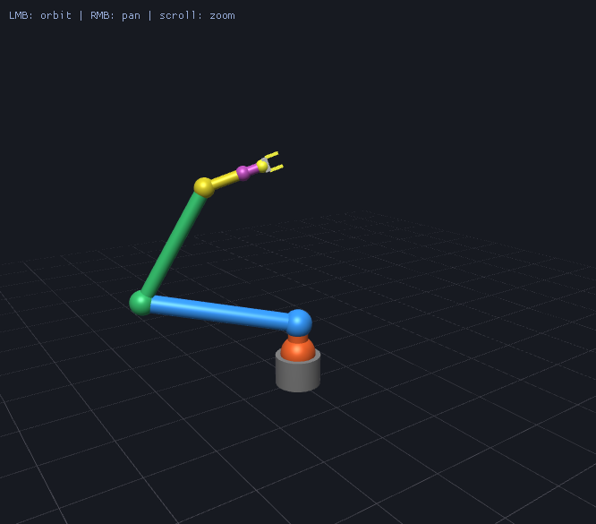

# ImGui Robot Viewer

A 6-DOF robot arm you can pose from sliders, in a single C++ window.
OpenGL 3.3, Dear ImGui, Eigen — and deliberately not much else.



| | | |
|:-:|:-:|:-:|
|  |  |  |
| Close on the wrist | From behind | Reaching across the grid |

## Try it

With [pixi](https://pixi.sh) installed, one command fetches the toolchain,
builds and starts the viewer:

```bash
pixi run viewer
```

| Task | What it does |
|------|--------------|
| `pixi run viewer` | Build and start the viewer |
| `pixi run test` | Build and run the tests |
| `pixi run shots` | Regenerate the images in this README |
| `pixi run build-debug` | A second build with the asserts on, in `build-debug/` |

`pixi.lock` pins every version, the compiler included, so a checkout builds
the same thing everywhere. Dear ImGui is the one thing CMake still fetches,
because its docking branch (`v1.91.8-docking`) is not packaged. The GL driver
is always the system's own.

Without pixi the CMake project works as it is, given GLFW, Eigen, zlib and the
GL headers from somewhere else:

```bash
sudo apt install cmake g++ libglfw3-dev libeigen3-dev mesa-common-dev zlib1g-dev
cmake -S . -B build && cmake --build build -j$(nproc)
```

## Controls

| Action | Control |
|--------|---------|
| Orbit | Left mouse button, drag |
| Pan | Right mouse button, drag |
| Zoom | Scroll wheel |
| Set a joint | Sliders in the right-hand panel |
| Reset one joint | `R` next to its slider |
| Reset everything | "Reset All Joints" |

The 3D view owns the pointer while you are over it, so dragging inside it
orbits. Panels move by their title bar or tab, never by their body — otherwise
grabbing the middle of a floating panel to move it would turn the arm instead.

Both panels live in a dock space, so you can re-dock, split or tear one loose.
The arrangement is remembered in `$XDG_CONFIG_HOME/robot_viewer/imgui.ini`;
delete that file to get the default back.

## What is in it

No glad, no glm, no scene graph. On Linux `libGL.so` already exports the GL 3.3
core entry points, Eigen covers the matrix math, and the arm is a table of
joints rather than a model file.

```
src/
├── main.cpp      — window, render loop, shaders, control panel
├── gl_core.h     — GL 3.3 entry points, no loader library
├── gl_math.h     — projection, view and transform matrices (Eigen)
├── gl_shader.*   — program building, uniform locations cached at link time
├── gl_mesh.*     — VAO/VBO ownership and the primitive generators
├── gl_target.*   — offscreen framebuffer the scene renders into
├── camera.*      — orbit camera
├── ui_layout.*   — dock space and the viewport panel's pointer handling
├── screenshot.*  — framebuffer readback and a small PNG encoder
└── robot.*       — joint table, forward kinematics, arm rendering
```

The scene renders into its own framebuffer and reaches the panel as a texture,
so it is an ordinary entry in ImGui's draw list rather than something painted
underneath it. That is what keeps it visible when a panel floats over another
one.

## Making it your own

- **A different arm** — edit `s_arm_joints` in `src/robot.cpp`. One row per
  joint: the parent's row index, axis, travel limits, offset from that parent,
  link radius, colour. The link length is the Y component of the offset, so
  there is one place to change it. More joints are more rows, and two rows
  naming the same parent give you a branch — a second arm off one shoulder
  needs no new data structure. The only rule is that a parent comes first in
  the table, which is what makes forward kinematics a single forward pass.
- **A real model** — add TinyGLTF and feed its meshes into `rbt_mesh_t` in
  place of the generated primitives.
- **Antialiasing** — `s_scene_samples` in `src/main.cpp`. Set it to 1 to switch
  multisampling off, worth trying on a software rasteriser such as llvmpipe
  where every sample costs CPU time.

## Tests

One host-side test, covering how pointer input is split between the camera and
the panels. No window, no GL context, a few milliseconds.

```bash
pixi run test
```

See [tests/ui_input/README.md](tests/ui_input/README.md) for what it checks.

## Screenshots

The viewer can photograph itself, so the images above are reproducible:

```bash
pixi run shots
```

Each one is a single `--shot` run with a camera and a pose:

```bash
./build/robot_viewer --shot out.png --size 1280x800 --view 40,18,4.3 \
                     --target 0,1.7,0 --pose 0,0,25,-70,-35,0,0
```

`--view` is yaw, pitch and distance; `--target` is the point it looks at;
`--pose` is one angle per joint in panel order. `--bare` captures the 3D view
without the panels, and `--help` lists the rest.
